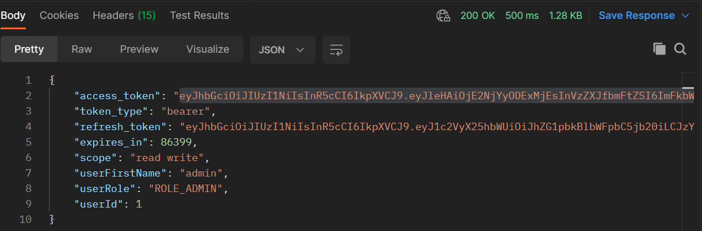

# Api Paises

A api Permite o Cadastro e Busca de paises.
  

## 🔨 Funcionalidades do projecto

- `Funcionalidade 1` `Cadastro de paises`: Para cadastrar um pais é necessario criar uma conta e fazer o login na api; 
  é  necessario informar os seguintes dados no formato json: nome, capital,regiao, subregiao e area.  
  Exemplo:

  ``
  {
  "area": 92.212 - Double,
  "capital": "Lisboa - String",
  "nome": "Portugal - String",
  "regiao": "Europa - String",
  "subRegiao": "Sul - String"
  }
  ``

- `Funcionalidade 2` `Modificação  de paises registrados`: Somente o usuario que cadastrou o pais ou um usuario administrador podera modificar o pais.
  é  necessario enviar todos dados do objecto. Exemplo :  
  ``
  {
  "area": 92.212 - Double,
  "capital": "Lisboa - String",
  "nome": "Portugal - String",
  "regiao": "Europa - String",
  "subRegiao": "Norte - String"
  }
  ``

- `Funcionalidade 3` `Modificação  parcial de paises registrados`: Somente o usuario que cadastrou o pais ou um usuario administrador podera modificar o pais.
  e não  é  necessario enviar todos dados do objecto, somente os atributos modificados. 
 Exemplo :

  ``
  {
  "area": 97.212 - Double,
  "capital": "Porto - String"
  }
  ``

- `Funcionalidade 5` `Listar todos paises registrados`: Retorna todos paises registrados, acesso permitido para todos;

- `Funcionalidade 6` `Listar todos paises registrados de forma paginada`: Retorna todos paises registrados de forma paginada, tem os seguintes parametros : page = pagina inicial, size = elementos por pagina, sort = ordenação  da lista por qualquer uma das suas propriedades, acesso permitido para todos;

- `Funcionalidade 7` `Pesquisar pais por nome`: Retorna dados de paises pelo nome passado por parametro, , acesso permitido para todos;

- `Funcionalidade 8` `Cadastro de usuarios`:A api possui dois tipos de perfil de usuario(Publico e Administrador), qualquer usuario publico pode registrar uma conta publica e somente usuarios administradores podem registrar outros administradores. é  necessario informar os seguintes dados no formato json: first-name, last-name, email e password.  
  Exemplo: ``{
  "firstName" : "Usuario",
  "lastName" : "Apelido",
  "email" : "usuario@email.com",
  "password" : "123456"
  }``

- `Funcionalidade 9` `Autenticação e Autorização de usuarios`:  A api valida os dados do usuario(email e password) e gera um token de acesso  e um "refresh token"  com validade de 24 horas, para acessar os recursos protegidos da api é  necessario usar o token de acesso gerado.

## ✔️ Técnicas e tecnologias utilizadas

- ``Java 17``
- ``Spring Boot``
- ``Spring Security``
- ``JWT``
- ``Postgresql``
- ``Swagger``
- ``Heroku``
- ``maven``
- ``Paradigma orientado a objectos e funcional``

## 📁 Acesso ao projecto hospedado

Link do projecto hospedado (https://tq-paises-api.herokuapp.com/paises
)

## 📁 Acesso ao projecto local
- Clone este repositorio ou baixe o arquivo .zip;

## 🛠️ Abrir e rodar o projecto

- Abrir o projecto na sua IDE favorita;
- Rodar o comando `mvn clean install` no terminal;

##  Documentação  do projecto

- A documentação  esta disponivel em (https://tq-paises-api.herokuapp.com/swagger-ui.html)

## Endpoints no Postman

- Coleção  Postman de todas operacoes e endpoints do projecto hospedado (https://www.getpostman.com/collections/d73f6b08f23110b23a66)
- Coleção  Postman de todas operacoes e endpoints do projecto local (https://www.getpostman.com/collections/64c2b5731dadd64259d5)

## Autenticação e Autorização

- Para efectuar o login na api é  necessario informar os seguintes dados de autorização: 

  Dados da api:
- `Tipo de autorização` : `Basic auth`;
- `username` : `myclientid`;
- `password` : `myclientsecret`;

  Dados do usuario no formato x-www-form-urlencoded:
- `username` : `email do usuario`;
- `password` : `password do usuario`;
- `grant-type` : `password`

Endpoint do login

-`[POST]` `oauth/token`

Acesso aos recursos protegidos

- `Tipo de autorização` : `Bearer token`;
- `Bearer token` : `token de acesso gerado pela api`

### Colaborador

- [Luiz Tique Junior](https://www.linkedin.com/in/luiz-tique-j%C3%BAnior-154251229/)
